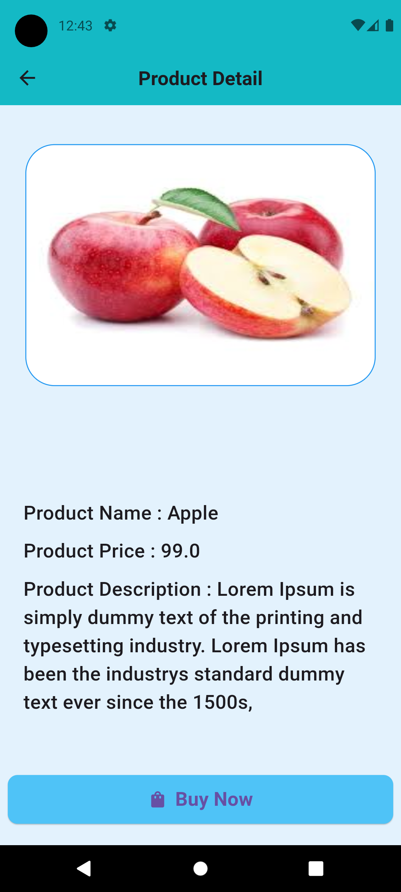
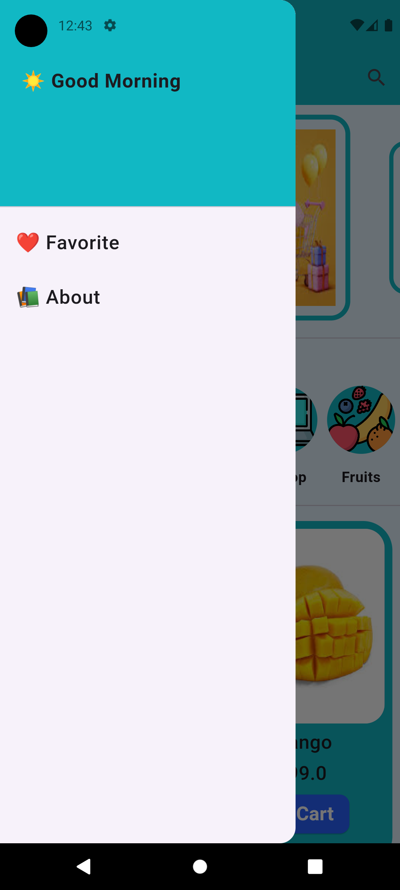
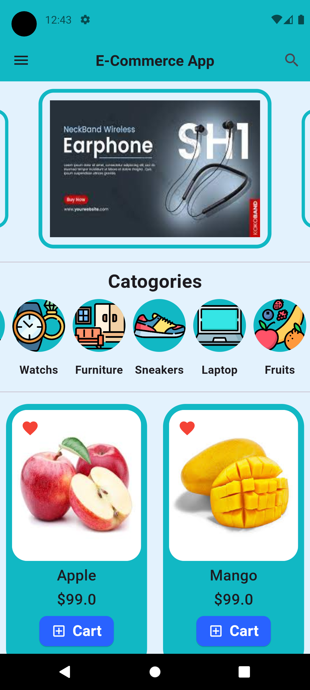
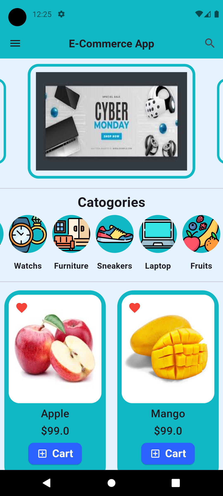

# Flutter Ecommerce Application

hello, here's a simple flutter Ecommerce Application with use of Provider State Management 

## Getting Started

This project is a starting point for a Flutter application.

A few resources to get you started if this is your first Flutter project:

- [Lab: Write your first Flutter app](https://docs.flutter.dev/get-started/codelab)
- [Cookbook: Useful Flutter samples](https://docs.flutter.dev/cookbook)

For help getting started with Flutter development, view the
[online documentation](https://docs.flutter.dev/), which offers tutorials,
samples, guidance on mobile development, and a full API reference.

## Authors

- [@Vinay Chavhan](https://www.github.com/vinay769)

## Screenshots

## Tech Stack

**Client:** Flutter

## Badges

